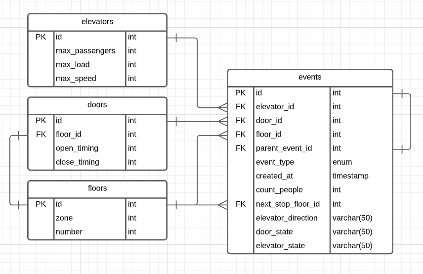

# Elevator System Design

## Requirements

- States: Up, Down, Idle
- Transfer passengers between floors
- Open doors only when state == Idle at the floor
- N floor and M elevators
- Elevator specification:
    - Max.number of passengers can carry
    - Max.load
    - Max.speed
- Minimize
    - Wait time of passengers
    - Wait time of system
    - Power usage
    - Maintenance
    - Cost
- Divide elevators in different zones
- Emergency Alarms
- VIP utility elevator
- Monitoring system

## Actors

1. Passenger (is not needed as a Class)
2. Elevator
3. Floors
4. Doors
5. Button panels
6. Dispatcher
7. Elevator System (Singleton)
8. Monitoring System

## Use cases

1. Call the elevator
    1. passenger push the button
    2. -> call the dispatcher
    3. -> determine witch elevator is more appropriate
    4. -> send elevator
2. Move / Stop elevator
3. Open / Close elevator's doors
4. Direction (Up/Down)
5. Emergency breaks
6. Emergency calls

## Algorithms

1. FIFO
    1. We put all elevator requests in a queue
    2. Elevator can be in several states:
        1. idle
        2. move same direction towards the passenger and direction the passenger wants to go
        3. move same direction towards the passenger but opposite direction the passenger wants to go
        4. elevator goes far away in opposite direction
2. Short Seek Time First (SSTF)
    1. Priority queue
3. SCAN
    1. Elevator is continuously moving which increase a cost
    2. Change direction only at the end
4. LOOK
    1. Elevator will look if there are requests in front of a queue -> if there are no request -> it stops
5. Destination Dispatch (with one button and many elevators which gather passengers who are moving in the same
   direction)

After a short research of elevator's system design, requirements and models, we can create a data model based on
information we received.

# Data Model

This kind of app will be work as `event driven` app, it means that a controller only receive a message when something
change, some state change occurs. Below you can see possible events that can be useful for performance analysis and
statistics.

## Events

- Every event can have (:time, :date, :source). Source can be elevator or passenger who press a button or door e.t.c.
- Register landing_request event (:flor, :direction)
    - then we can assign the request to elevator and get data like (:expected_response_time, :average_response_time, :
      hi_threshold_time, :threshold_load)
- Floor event (:next_stop_floor, :elevator_direction)
- Door event (:door_state = locked,closed, opened)

Base on these events we can create a database model and use it for a logging.

# Database model



## Queries

### Average waiting time per passenger
`event_type`
- <b>landing_call</b> - when a passenger push a call button on a floor
- <b>elevator_opens_door</b> - when an elevator has arrived and opens doors
```
SELECT AVG(TIME_TO_SEC(TIMEDIFF(e2.created_at, e1.created_at))) as avg_wait_time_sec
FROM events as e1
         INNER JOIN events as e2 ON e1.id = e2.parent_event_id
    AND e2.event_type = 'elevator_opens_door'
WHERE e1.event_type = 'landing_call'
```

### Average journey time per passenger
`event_type`
- <b>select_target_floor</b> - when a passenger push a button of target floor inside the elevator
- <b>achieved_target_floor</b> - when an elevator has arrived to target floor
```
SELECT AVG(TIME_TO_SEC(TIMEDIFF(e2.created_at, e1.created_at))) as avg_journey_time_sec
FROM events as e1
         INNER JOIN events as e2 ON e1.id = e2.parent_event_id
    AND e2.event_type = 'achieved_target_floor'
WHERE e1.event_type = 'select_target_floor'
```

### count events
Any type of events can be used in query
```
SELECT DISTINCT elevator_id,
                SUM(IF(event_type = 'elevator_opens_door', 1, 0))
                    OVER (PARTITION BY elevator_id) as door_opens_count
FROM events as e
WHERE elevator_id IS NOT NULL
```

### Average idle time per elevator
``` 
SELECT e1.elevator_id,
       AVG(TIME_TO_SEC(TIMEDIFF(e2.created_at, e1.created_at))) as avg_idle_time_sec
FROM events e1
         LEFT JOIN events e2 ON e1.elevator_id = e2.elevator_id
    AND e2.parent_event_id = e1.id
    AND e2.created_at > e1.created_at
WHERE e1.elevator_state = 'idle'
GROUP BY e1.elevator_id
```